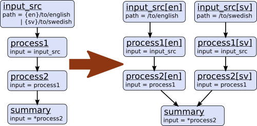

===============
Pipeline config
===============

A Pimlico pipeline, as read from a config file (:class:`pimlico.core.config.PipelineConfig`) contains all the
information about the pipeline being processed and provides access to specific modules in it. A config file
looks much like a standard ``.ini`` file, with sections headed by ``[section_name]`` headings, containing key-value
parameters of the form ``key=value``.

Each section, except for ``vars`` and ``pipeline``, defines a module instance in the pipeline. Some of these can
be executed, others act as filters on the outputs of other modules, or input readers.

Each section that defines a module has a ``type`` parameter. Usually, this is a fully-qualified Python package
name that leads to the module type's Python code (that package containing the ``info`` Python module). A special
type is ``alias``. This simply defines a module alias -- an alternative name for an already defined module. It
should have exactly one other parameter, ``input``, specifying the name of the module we're aliasing.

Special sections
----------------

- vars:
    May contain any variable definitions, to be used later on in the pipeline. Further down, expressions like
    ``%(varname)s`` will be expanded into the value assigned to ``varname`` in the vars section.
- pipeline:
    Main pipeline-wide configuration. The following options are required for every pipeline:

    * ``name``: a single-word name for the pipeline, used to determine where files are stored
    * ``release``: the release of Pimlico for which the config file was written. It is considered compatible with
      later minor versions of the same major release, but not with later major releases. Typically, a user
      receiving the pipeline config will get hold of an appropriate version of the Pimlico codebase to run it
      with.

    Other optional settings:

    * ``python_path``: a path or paths, relative to the directory containing the config file, in which Python
      modules/packages used by the pipeline can be found. Typically, a config file is distributed with a
      directory of Python code providing extra modules, datatypes, etc. Multiple paths are separated by colons (:).

Special variable substitutions
------------------------------

Certain variable substitutions are always available, in addition to those defined in ``vars`` sections.
Use them anywhere in your config file with an expression like ``%(varname)s`` (note the ``s`` at the end).

- ``pimlico_root``:
    Root directory of Pimlico, usually the directory ``pimlico/`` within the project directory.
- ``project_root``:
    Root directory of the whole project. Current assumed to always be the parent directory of ``pimlico_root``.
- ``output_dir``:
    Path to output dir (usually ``output`` in Pimlico root).
- ``long_term_store``:
    Long-term store base directory being used under the current config. Can be used to link to data from
    other pipelines run on the same system. This is the value specified in the :ref:`local config file <local-config>`.
- ``short_term_store``:
    Short-term store base directory being used under the current config. Can be used to link to data from
    other pipelines run on the same system. This is the value specified in the :ref:`local config file <local-config>`.
- ``home``:
    Running user's home directory (on Unix and Windows, see Python's ``os.path.expanduser()``).

For example, to point a parameter to a file located within the project root:

.. code-block:: ini

   param=%(project_root)s/data/myfile.txt

Directives
----------

Certain special directives are processed when reading config files. They are lines that begin with ``%%``, followed
by the directive name and any arguments.

- ``variant``:
    Allows a line to be included only when loading a particular variant of a pipeline. For more detail on
    pipeline variants, see :doc:`/core/variants`.

    The variant name is
    specified as part of the directive in the form: ``variant:variant_name``. You may include the line in more
    than one variant by specifying multiple names, separated by commas (and no spaces). You can use the default
    variant "main", so that the line will be left out of other variants. The rest of the line, after the directive
    and variant name(s) is the content that will be included in those variants.

    .. code-block:: ini
       :emphasize-lines: 3,4

       [my_module]
       type=path.to.module
       %%variant:main size=52
       %%variant:smaller size=7

   An alternative notation for the variant directive is provided to make config files more readable. Instead of
   ``variant:variant_name``, you can write ``(variant_name)``. So the above example becomes:

    .. code-block:: ini
       :emphasize-lines: 3,4

          [my_module]
          type=path.to.module
          %%(main) size=52
          %%(smaller) size=7

- ``novariant``:
    A line to be included only when not loading a variant of the pipeline. Equivalent to ``variant:main``.

    .. code-block:: ini
       :emphasize-lines: 3

       [my_module]
       type=path.to.module
       %%novariant size=52
       %%variant:smaller size=7

- ``include``:
    Include the entire contents of another file. The filename, specified relative to the config file in which the
    directive is found, is given after a space.
- ``abstract``:
    Marks a config file as being abstract. This means that Pimlico will not allow it to be loaded as a top-level
    config file, but only allow it to be included in another config file.
- ``copy``:
    Copies all config settings from another module, whose name is given as the sole argument. May be used multiple
    times in the same module and later copies will override earlier. Settings given explicitly in the module's
    config override any copied settings. The following settings are not copied: input(s), ``filter``, ``outputs``,
    ``type``.

    For example, to reuse all the parameters from ``module1`` in ``module2``, only specifying them once:

    .. code-block:: ini
       :emphasize-lines: 4,5,6,12

       [module1]
       type=some.module.type
       input=moduleA
       param1=56
       param2=never
       param3=0.75

       [module2]
       type=some.module.type
       input=moduleB
       # Copy all params from module1
       %%copy module1

.. _parameter-alternatives:

Multiple parameter values
-------------------------

Sometimes you want to write a whole load of modules that are almost identical, varying in just one or two
parameters. You can give a parameter multiple values by writing them separated by vertical bars (``|``). The module
definition will be expanded to produce a separate module for each value, with all the other parameters being
identical.

For example, this will produce three module instances, all having the same ``num_lines`` parameter, but each with
a different ``num_chars``:

.. code-block:: ini
   :emphasize-lines: 4

   [my_module]
   type=module.type.path
   num_lines=10
   num_chars=3|10|20

You can even do this with multiple parameters of the same module and the expanded modules will cover all
combinations of the parameter assignments.

For example:

.. code-block:: ini
   :emphasize-lines: 3,4

   [my_module]
   type=module.type.path
   num_lines=10|50|100
   num_chars=3|10|20

Tying alternatives
~~~~~~~~~~~~~~~~~~

You can change the behaviour of alternative values using the ``tie_alts`` option. ``tie_alts=T`` will cause
parameters within the same module that have multiple alternatives to be expanded in parallel, rather than
taking the product of the alternative sets. So, if ``option_a`` has 5 values and ``option_b`` has 5 values, instead
of producing 25 pipeline modules, we'll only produce 5, matching up each pair of values in their alternatives.

.. code-block:: ini

   [my_module]
   type=module.type.path
   tie_alts=T
   option_a=1|2|3|4|5
   option_b=one|two|three|four|five

If you want to tie together the alternative values on some parameters, but not others, you can specify groups
of parameter names to tie using the ``tie_alts`` option. Each group is separated by spaces and the names of
parameters to tie within a group are separated by ``|`` s. Any parameters that have alternative values but are
not specified in one of the groups are not tied to anything else.

For example, the following module config will tie together ``option_a``'s alternatives with ``option_b``'s, but
produce all combinations of them with ``option_c`` 's alternatives, resulting in 3*2=6 versions of the module
(``my_module[option_a=1~option_b=one~option_c=x]``, ``my_module[option_a=1~option_b=one~option_c=y]``,
``my_module[option_a=2~option_b=two~option_c=x]``, etc).

.. code-block:: ini
   :emphasize-lines: 3

   [my_module]
   type=module.type.path
   tie_alts=option_a|option_b
   option_a=1|2|3
   option_b=one|two|three
   option_c=x|y

Using this method, you must give the parameter names in ``tie_alts`` exactly as you specify them in the config.
For example, although for a particular module you might be able to specify a certain input (the default)
using the name ``input`` or a specific name like ``input_data``, these will not be recognised as being the same
parameter in the process of expanding out the combinations of alternatives.

Naming alternatives
~~~~~~~~~~~~~~~~~~~

Each module will be given a distinct name, based on the varied parameters. If just one is varied, the names
will be of the form ``module_name[param_value]``. If multiple parameters are varied at once, the names will be
``module_name[param_name0=param_value0~param_name1=param_value1~...]``. So, the first example above will produce:
``my_module[3]``, ``my_module[10]`` and ``my_module[20]``. And the second will produce: ``my_module[num_lines=10~num_chars=3]``,
``my_module[num_lines=10~num_chars=10]``, etc.

You can also specify your own identifier for the alternative parameter values, instead of using the values
themselves (say, for example, if it's a long file path). Specify it surrounded by curly braces at the
start of the value in the alternatives list. For example:

.. code-block:: ini
   :emphasize-lines: 3

      [my_module]
      type=module.type.path
      file_path={small}/home/me/data/corpus/small_version|{big}/home/me/data/corpus/big_version

This will result in the modules ``my_module[small]`` and ``my_module[big]``, instead of using the whole file
path to distinguish them.

An alternative approach to naming the expanded alternatives can be selected using the ``alt_naming`` parameter.
The default behaviour described above corresponds to ``alt_naming=full``. If you choose ``alt_naming=pos``, the
alternative parameter settings (using names where available, as above) will be distinguished like positional
arguments, without making explicit what parameter each value corresponds to. This can make for nice concise
names in cases where it's clear what parameters the values refer to.

If you specify ``alt_naming=full`` explicitly, you can also give a further option ``alt_naming=full(inputnames)``.
This has the effect of removing the ``input_`` from the start of named inputs. This often makes for
intuitive module names, but is not the default behaviour, since there's no guarantee that the input name
(without the initial ``input_``) does not clash with an option name.

Another possibility, which is occasionally appropriate, is ``alt_naming=option(<name>)``, where ``<name>`` is the
name of an option that has alternatives. In this case, the names of the alternatives for the whole module will
be taken directly from the alternative names on that option only. (E.g. specified by ``{name}`` or inherited
from a previous module, see below). If there's only one option with alternatives, this is equivalent to
``alt_naming=pos``. If there are multiple, it might often lead to name clashes. The circumstance in which this is
most commonly appropriate is where you use ``tie_alts=T``, so it's sufficient to distinguish the alternatives by
the name associated with just one option.

Expanding alternatives down the pipeline
~~~~~~~~~~~~~~~~~~~~~~~~~~~~~~~~~~~~~~~~

If a module takes input from a module that has been expanded into multiple versions for alternative parameter
values, it too will automatically get expanded, as if all the multiple versions of the previous module had
been given as alternative values for the input parameter. For example, the following will result in 3 versions
of ``my_module`` (``my_module[1]``, etc) and 3 corresponding versions of ``my_next_module`` (``my_next_module[1]``, etc):

.. code-block:: ini

   [my_module]
   type=module.type.path
   option_a=1|2|3

   [my_next_module]
   type=another.module.type.path
   input=my_module

Where possible, names given to the alternative parameter values in the first module will be carried through
to the next.

Module variables: passing information through the pipeline
----------------------------------------------------------

When a pipeline is read in, each module instance has a set of *module variables* associated with it. In your
config file, you may specify assignments to the variables for a particular module. Each module inherits all
of the variable assignments from modules that it receives its inputs from.

The main reason for having module variables it to be able to do things in later modules that depend on what
path through the pipeline an input came from. Once you have defined the sequence of processing steps that
pass module variables through the pipeline, apply mappings to them, etc, you can use them in the parameters
passed into modules.

Basic assignment
~~~~~~~~~~~~~~~~

Module variables are set by including parameters in a module's config of the form ``modvar_<name> = <value>``. This
will assign ``value`` to the variable ``name`` for this module. The simplest form of assignment is just a string literal,
enclosed in double quotes:

.. code-block:: ini

   [my_module]
   type=module.type.path
   modvar_myvar = "Value of my variable"

Names of alternatives
~~~~~~~~~~~~~~~~~~~~~

Say we have a simple pipeline that has a single source
of data, with different versions of the dataset for different languages (English and Swedish).
A series of modules process each language
in an identical way and, at the end, outputs from all languages are collected by a single ``summary`` module.
This final
module may need to know what language each of its incoming datasets represents, so that it can output something
that we can understand.

The two languages are given as alternative values for a parameter ``path``, and the whole pipeline gets
automatically expanded into two paths for the two alternatives:

The ``summary`` module gets its two inputs for the two different languages as a multiple-input: this means we could
expand this pipeline to as many languages as we want, just by adding to the ``input_src`` module's ``path`` parameter.

However, as far as ``summary`` is concerned, this is just a list of datasets -- it doesn't know that one of them is
English and one is Swedish. But let's say we want it to output a table of results. We're going to need some labels
to identify the languages.

The solution is to add a module variable to the first module that takes different values when it gets expanded
into two modules. For this, we can use the ``altname`` function in a modvar assignment: this assigns the name of
the expanded module's alternative for a given parameter that has alternatives in the config.

.. code-block:: ini

   [input_src]
   path={en}/to/english | {sv}/to/swedish
   modvar_lang=altname(path)

Now the expanded module ``input_src[en]`` will have the module variable ``lang="en"`` and the Swedish version ``lang="sv"``.
This value gets passed from module to module down the two paths in the pipeline.

Other assignment syntax
~~~~~~~~~~~~~~~~~~~~~~~

A further function ``map`` allows you to apply a mapping to a value, rather like a Python dictionary lookup. Its
first argument is the value to be mapped (or anything that expands to a value, using modvar assignment syntax).
The second is the mapping. This is simply a space-separated list of source-target mappings of the form
``source -> target``. Typically both the sources and targets will be string literals.

Now we can give our languages legible names. (Here we're splitting the definition over multiple indented lines, as
permitted by config file syntax, which makes the mapping easier to read.)

.. code-block:: ini

   [input_src]
   path={en}/to/english | {sv}/to/swedish
   modvar_lang=map(
       altname(path),
       "en" -> "English"
       "sv" -> "Svenska")

The assignments may also reference variable names, including those previously assigned to in the same module and
those received from the input modules.

.. code-block:: ini

   [input_src]
   path={en}/to/english | {sv}/to/swedish
   modvar_lang=altname(path)
   modvar_lang_name=map(
       lang,
       "en" -> "English"
       "sv" -> "Svenska")

If a module gets two values for the same variable from multiple inputs, the first value will simply be overridden
by the second. Sometimes it's useful to map module variables from specific inputs to different modvar names.
For example, if we're combining two different languages, we might need to keep track of what the two languages
we combined were. We can do this using the notation ``input_name.var_name``, which refers to the value of module
variable ``var_name`` that was received from input ``input_name``.

.. code-block:: ini

   [input_src]
   path={en}/to/english | {sv}/to/swedish
   modvar_lang=altname(path)

   [combiner]
   type=my.language.combiner
   input_lang_a=lang_data
   input_lang_b=lang_data
   modvar_first_lang=lang_a.lang
   modvar_second_lang=lang_b.lang

Use in module parameters
~~~~~~~~~~~~~~~~~~~~~~~~

To make something in a module's execution
dependent on its module variables, you can insert them into module parameters.

For example, say we want one of the module's parameters to make use of the ``lang`` variable we defined above:

.. code-block:: ini

   [input_src]
   path={en}/to/english | {sv}/to/swedish
   modvar_lang=altname(path)
   some_param=$(lang)

Note the difference to other variable substitutions, which use the ``%(varname)s`` notation. For modvars, we
use the notation ``$(varname)``.

We can also put the value in the middle of other text:

.. code-block:: ini

   [input_src]
   path={en}/to/english | {sv}/to/swedish
   modvar_lang=altname(path)
   some_param=myval-$(lang)-continues

The modvar processing to compute a particular module's set of variable assignments is performed before the
substitution. This means that you can do any modvar processing specific to the module instance, in the various
ways defined above, and use the resulting value in other parameters. For example:

.. code-block:: ini

   [input_src]
   path={en}/to/english | {sv}/to/swedish
   modvar_lang=altname(path)
   modvar_mapped_lang=map(lang,
         "en" -> "eng"
         "sv" -> "swe"
      )
   some_param=$(mapped_lang)

You can also place in the ``$(...)`` construct any of the variable processing operations shown above for assignments
to module variables. This is a little more concise than first assigning values to modvars, if you don't need
to use the variables again anywhere else. For example:

.. code-block:: ini

   [input_src]
   path={en}/to/english | {sv}/to/swedish
   some_param=$(map(altname(path)),
         "en" -> "eng"
         "sv" -> "swe"
      ))

Usage in module code
~~~~~~~~~~~~~~~~~~~~

A module's executor can also retrieve the values assigned to module variables from the ``module_variables``
attribute of the module-info associated with the input dataset. Sometimes this can be useful when you are
writing your own module code, though the above usage to pass values from (or dependent on) module variables
into module parameters is more flexible, so should generally be preferred.

.. code-block:: py

   # Code in executor
   # This is a MultipleInput-type input, so we get a list of datasets
   datasets = self.info.get_input()
   for d in datasets:
       language = d.module.module_variables["lang"]
